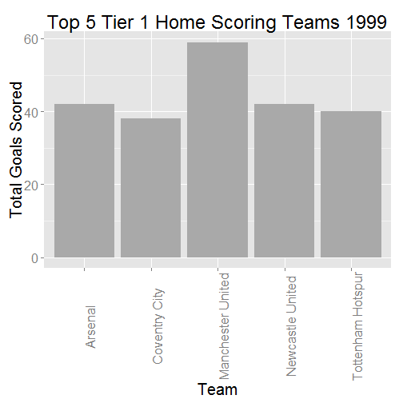

## Project Description

The purpose of my project is to visualize top scoring teams in England based on the following user inputs:

1. Season(Year Start Date)
2. League Tier
3. Number of Teams to Display.

This is a good tool for people wanting to know who was the most entertaining team for a given season or those who are fans of trivia!

--- .class #id 

## Summary of Data

My analysis is based on data provided by the package engsoccerdata.

Here is a short summary of the data. It includes information such as home team, away team, goals scored by each and result. This data does not include specific player information,however.


```
##         Date Season            home          visitor  FT hgoal vgoal
## 1 1888-12-15   1888 Accrington F.C.      Aston Villa 1-1     1     1
## 2 1889-01-19   1888 Accrington F.C. Blackburn Rovers 0-2     0     2
## 3 1889-03-23   1888 Accrington F.C. Bolton Wanderers 2-3     2     3
##   division tier totgoal goaldif result
## 1        1    1       2       0      D
## 2        1    1       2      -2      A
## 3        1    1       5      -1      A
```

--- .class #id 

## Sample Graph

Here is a sample output from the shiny app. I have hardcoded user inputs.

 

--- .class #id 


## Future Improvements/Next Steps

There are a few improvements that I'd like to do.

1. Apply ML and compare home winning percentage to league standings.
2. Add flexibility to include analysis from different leagues.
3. Create dashboards that show trending of specific teams.

This analysis could be useful in helping see trends of particular soccer teams over time in respect to their playing style and other details.


